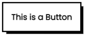

# Documentation - Eccentric Touch

## Introduction


## How to Link

Copy and Paste the Code snippet given below, this will connect the v.1.0 of Eccentric Touch to your webpage.

```html
<link rel="stylesheet" href="https://cdn.jsdelivr.net/gh/DesignSystemsOSS/eccentrictouch@master/src/lib/eccentric.css">
```

## Components

### Buttons

|Class Name|Output|
|----------|------|
|**cartoon_button**||
|**cartoon_button non_decorated**||
|**cartoon_button_hoverable**||
|**cartoon_button_semicurved_hoverable**||
|**cartoon_button_curved_hoverable**||


### Fonts

|Fonts|Description|Sample|
|----------|------|------|
|**Poppins**|This is the main`font-family`for this version.| |

### Links

|Class Name|Output|
|----------|------|
|**cartoon_active_link**||
|**cartoon_underlined_link**||
|**cartoon_non_underlined_link**||

#### Heading Tags


#### Other Tags


### Colors


#### Color Usage & Properties


