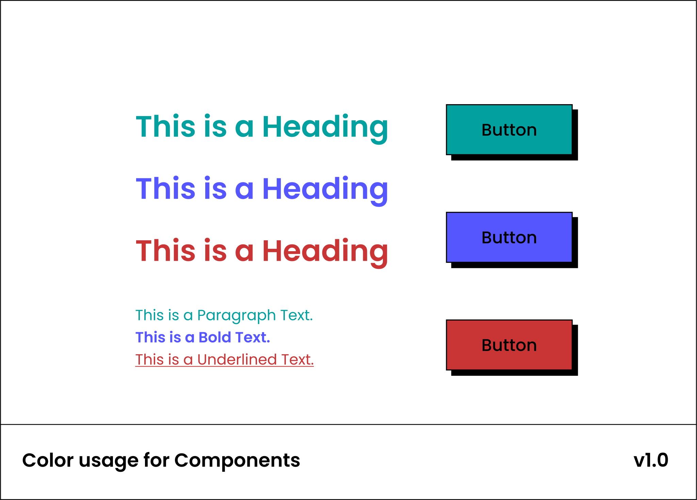

# Documentation - Eccentric Touch (v1.0)

## Introduction

Creating a whole website from scratch isn't a piece of cake. It takes hard work, patience and resilience. The task of designing each component for the website can be quite intimidating. We understand your problem and have brought you a solution for the same.

The DesignSystems is a one step solution to all your frontend crises. Backed with some of the great designers, you here, will find the visuals that catch your eye. It will with no doubt give your website a visual upgrade. What are you waiting for? 

Go give it a try!

## How to Link

Copy and Paste the Code snippet given below, this will connect the v.1.0 of Eccentric Touch to your webpage.

```html
<link rel="stylesheet" href="https://cdn.jsdelivr.net/gh/DesignSystemsOSS/eccentrictouch@v1.0/src/lib/eccentric.css">
```

## Components

### Buttons


``` html
<a href="#" class="cartoon_button">Button</a>
```


``` html
<a href="#" class="cartoon_button_hoverable">Button</a>
```


``` html
<a href="#" class="cartoon_button_semicurved_hoverable">Button</a>
```


``` html
<a href="#" class="cartoon_button_curved_hoverable">Button</a>
```


``` html
<a href="#" class="cartoon_active_link">Button</a>
```


``` html
<a href="#" class="cartoon_underlined_link">Button</a>
```


``` html
<a href="#" class="cartoon_non_underlined_link">Button</a>
```


``` html
<a href="#" class="cartoon_multi_layer_button">Button</a>
```

### Fonts

|Fonts|Description|Sample|
|----------|------|------|
|**Poppins**|This is the main`font-family`for this version. <br>For you to understand , Poppins is just like oxygen. Any environment will accept it.| |


#### Heading Tags


``` html
<h1>This is a Heading</h1>
<h2>This is a Heading</h2>
<h3>This is a Heading</h3>
<h4>This is a Heading</h4>
<h5>This is a Heading</h5>
<h6>This is a Heading</h6>
```

#### General Text Based Tags


``` html
<p>This is a paragraph text</p>
<b>This is a bold text</b>
<i>This is an italic text</i>
<u>This is an underlined text</u>
<q>This is a quoted text</q>
```

### Colors


``` CSS
/** General Colors **/
  .font-teal {
    color: #03A0A0;
  }
  .font-purple {
    color: #001AFF;
  }
  .font-green {
    color: #28BD2B;
  }
  .font-blue {
    color: #5656FF;
  }
  .font-red {
    color: #C93434;
  }
```

``` CSS
/** Background Colors **/
  .bg-teal {
    color: #03A0A0;
  }
  .bg-purple {
    color: #001AFF;
  }
  .bg-green {
    color: #28BD2B;
  }
  .bg-blue {
    color: #5656FF;
  }
  .bg-red {
    color: #C93434;
  }
```

#### Color Usage & Properties




``` html
<h2 class="font-teal">This is a Heading </h2>
<h2 class="font-purple">This is a Heading </h2>
<h2 class="font-red">This is a Heading </h2>
```
```html
<p class="font-teal">This is a Paragraph Text.</p>
<b class="font-purple">This is a Bold Text.</b>
<u class="font-red">This is a Underlined Text.</u>
```
```html
<a href="#" class="cartoon_button bg-teal"> Button </a>
<a href="#" class="cartoon_button bg-purple"> Button </a>
<a href="#" class="cartoon_button bg-red"> Button </a>
```